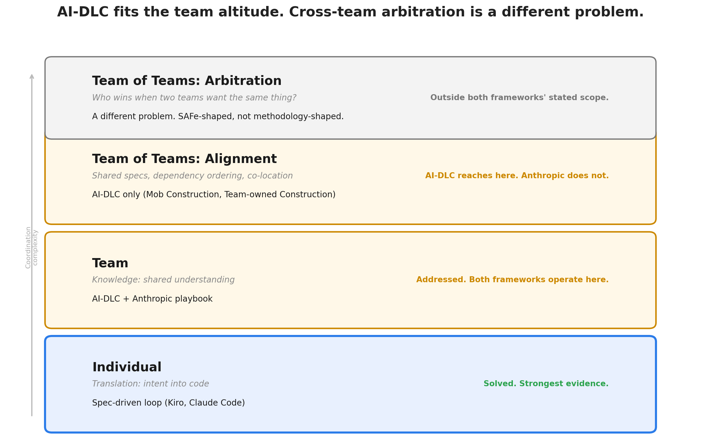

# AI-DLC Fits the Team Altitude. Cross-Team Arbitration Is a Different Problem.

**A three-altitude map showing what Agile/Scrum/SAFe already solve, what AI changes, and where AI-DLC actually sits.**

---

## The short answer

AI-DLC, AWS's *AI-Driven Development Lifecycle*, operates at the team altitude, the same one Scrum occupies, with AI substituted into roles a person or meeting used to hold. It extends to multiple teams for *alignment* on one already-agreed plan, matching its own scope claim ("multiple teams working cohesively"). What it doesn't provide is *arbitration* between teams that want different, competing things, the job SAFe exists to do. That's not a gap in what AI-DLC promised, but a boundary between two different jobs. Anthropic's *AI-Native SDLC* playbook doesn't reach multiple teams in either sense. Spec-driven development sits one level below, at the individual altitude, where the strongest evidence for AI's gain actually is.

| Altitude | The problem | Pre-AI answer | AI-era answer |
|---|---|---|---|
| **Individual** | *Translation*: intent into working code | Solo discipline (TDD) | Personal spec-driven loop |
| **Team** | *Knowledge*: several minds, one shared picture | Scrum, pair/mob programming | AI-DLC, Anthropic's playbook |
| **Team of teams** | *Authority*: who gets the contested resource | SAFe (WSJF, Business Owners, PI Planning) | AI-DLC reaches here for cohesive execution; neither AI framework addresses contested priorities |

A tool that solves one altitude's problem doesn't automatically solve the next. Conflating them is the most common reason a methodology "should have worked" and didn't.

## What AI actually changes

AI's effect is concentrated almost entirely at the individual altitude. Task speedups of 20-56% appear across controlled studies ([Peng et al. 2023](https://arxiv.org/abs/2302.06590)), and three field experiments across 4,867 developers found a 26% increase in completed tasks ([Cui et al., Management Science](https://www.microsoft.com/en-us/research/publication/the-effects-of-generative-ai-on-high-skilled-work-evidence-from-three-field-experiments-with-software-developers/)). The strongest longitudinal study found gains compounding with use, 1.5x at three months, 2x at nine ([He et al., arxiv 2607.01904](https://arxiv.org/abs/2607.01904)). The mechanism: the expensive part of AI-assisted work is verifying code, not generating it, and a spec relocates that verification before code exists.

That gain does not survive contact with the team and team-of-teams altitudes automatically:

| Source | Individual signal | Organizational signal |
|---|---|---|
| [DX](https://getdx.com/blog/ai-productivity-gains-more-modest-than-expected/), 121K devs | AI usage up 65% | PR throughput up 7.76% (median) |
| [NBER w35275](https://www.nber.org/papers/w35275), 100K+ devs | Lines of code up 741% | Releases up ~20% |
| [Faros AI](https://www.faros.ai/blog/ai-software-engineering), 10K+ devs | 98% more PRs merged | No measurable org-level improvement |

Why: review and integration are still paced by human judgment, and per [DORA](https://cloud.google.com/blog/products/ai-machine-learning/announcing-the-2025-dora-report), AI is an amplifier. Loosely coupled teams see real gains, tightly coupled teams see little. AI made the individual problem cheaper; it didn't touch the team or team-of-teams coordination problems, which became the visible bottleneck.

**Why the headline studies seem to contradict each other.** One study says 55% faster, another says 19% slower, a third says organizational throughput barely moved. They measured three different things. Peng et al. and METR measured individuals; DX, NBER, and Faros measured organizations, so an individual gain has to survive two more altitudes to reach production. Peng et al.'s task was well-scoped and self-contained; METR's were real issues in mature repositories averaging over a million lines, which is most of the +44%-versus-+12% split. And every number here is a *gain*, AI-assisted performance minus the unassisted human, and that baseline isn't constant: METR's developers had years of tacit knowledge of their own codebases, so the AI had little left to add, while METR itself expects AI to help more in unfamiliar codebases. AI's measured value is largest where the human knows least, worth remembering whenever you see a single headline percentage.

Work type matters too, independent of altitude: gains concentrate in newer repos (+44%) and are statistically insignificant in legacy ones (+12%, [He et al.](https://arxiv.org/abs/2607.01904)). [METR's RCT](https://metr.org/blog/2025-07-10-early-2025-ai-experienced-os-dev-study/) found experienced developers 19% *slower* with AI on their own mature repositories, while believing themselves 20% faster. Roughly: new product work (~10-20% of typical effort) sees the most benefit, clean context and no legacy; enhancement work (~40-50%, the majority) sees the least, bounded by existing architecture and contracts AI can't see; maintenance (~30-40%) sees a lot of benefit per task, since bug fixes are small and bounded. If most of your effort is enhancement, most of your work sits where AI delivers least. AI-DLC adapts its *stages* by work type (confirmed scopes: `poc`, `bugfix`, `refactor`, `infra`, `security-patch`, `mvp`), but no published methodology adapts the *expected gain* by work type, so a plan assuming one improvement figure across all modes will overstate its benefit even when the process correctly adapts.

## Where AI-DLC actually sits

AI-DLC and Anthropic's playbook both retarget individual and team mechanisms with AI substituted in; neither introduces a new altitude. At the individual altitude, both formalize the personal spec-driven loop: an explicit plan artifact, human-validated before AI implements it.

At the team altitude, AI-DLC's Mob Elaboration closes the knowledge gap between people using AI to draft faster than a meeting would. Its multi-team claim is real: the [method paper](https://prod.d13rzhkk8cj2z0.amplifyapp.com/aidlc.pdf) states the method is for systems "typically involving multiple teams working cohesively," and Mob Construction has "all teams collocated in a single room." The open-source workflows add Team-owned Construction: once a plan is agreed, sub-teams each claim a Unit and build in parallel, merging through an integration lead. This works, but it assumes **one plan, already agreed**: claiming is first-come, with no arbitration for genuine contention. Anthropic's playbook doesn't reach this altitude at all; its "parallelism" is one engineer running multiple AI sessions.

What neither framework provides is *arbitration*: standing to decide which team's priority wins when two teams want the same resource and neither will yield. SAFe supplies that as machinery: WSJF ranks work by cost of delay over size, Business Owners set value inputs so a team can't score its own feature up, PI Planning is the forum where the binding answer gets recorded. Shared specification (what AI-DLC provides) solves a different problem, making sure teams understand the same plan, not deciding whose plan wins when teams want different things. This is the same authority gap Scrum always had, now more visible because AI made everything below it faster. Organizations that need it will have to build it themselves, regardless of methodology.

## If you're moving from Scrum

Untested as a sequence, but inferred from the mechanics above. Process and tooling have to move together: process without tooling produces rushed ceremony, and tooling without process just automates old habits faster.

**Process:** Collapse requirements-and-design into one synchronous session (Mob Elaboration). Shrink the sprint container once build collapses to hours, but only as a consequence of tooling speed, not a principle on its own. Loosen synchronicity during execution via Team-owned Construction, but only where architecture is already loosely coupled (tight coupling plus isolated execution is a bad combination). Stand up a SAFe-shaped mechanism for genuine cross-team contention, since neither Scrum nor AI-DLC answers it.

**Tooling:** A spec-driven loop per person, first, since team ceremonies assume this habit already exists. A shared, versioned home for elaboration's output (a committed artifact, not a meeting that ends in private understanding). A claim-and-merge mechanism if adopting Team-owned Construction. Review capacity that scales with output, built *ahead* of rollout if you can: the one clear org-level success case converted review standards into automation as volume rose (human coverage 89% to 68%, automated 19% to 84%) fast enough to absorb 3.1x volume, but that was reactive, not proactive, and most organizations won't match that speed if they wait.

Getting all of this right only closes the team altitude's knowledge gap. It does nothing for the team-of-teams authority gap.

## Where the leverage actually is

Ordered by evidence, not ease of action:

1. **Architecture and platform quality.** Loosely coupled teams see gains; tightly coupled teams see little. This determines how much of the individual gain can ever reach production, before any methodology is involved. Slowest to fix, highest leverage.
2. **Depth of individual practice.** The compounding effect (roughly 2x at nine months) rewards going deeper on the personal spec-driven loop over adding more tools.
3. **Knowledge alignment (AI-DLC/Anthropic's playbook, adopt selectively).** Useful for genuine cross-person or cross-team knowledge gaps. A team already running the personal loop gets nothing new there from adopting either framework. What they add is scoped to altitudes a single-player tool can't reach: aligning several people's mental models, and git-native multi-team execution infrastructure with no single-player equivalent. AI-DLC's own paper attributes real velocity to the ceremony specifically: Mob Elaboration "condenses weeks or even months of sequential work into a few hours," replacing async coordination with a synchronous session, not AI writing code faster.
4. **Downstream capacity, chiefly review.** Build automation ahead of volume if you can; react fast if you can't. Falling behind here is the most common reason individual gains never reach the top line.
5. **Team-of-teams authority.** No current AI methodology addresses this, consistent with what each claims to solve rather than a shortfall. You need an actual person or forum with standing to decide, built from outside any AI methodology's materials.

## What the roles become

As authoring got cheap, the center of the job moved from writing code to reviewing, directing, and integrating it. Substantive review (carrying a human comment) fell from about 39% to 21% of PRs in the one company where this was measured. DORA calls this the **expertise paradox**: AI lowers the barrier to entry while bypassing the struggle that builds deep expertise, and the capacity to evaluate AI output stays concentrated among the same experienced people a review-heavy workload burns down fastest.

**If you are an individual contributor, the concrete version.** Have the AI produce the plan before any code, then read it the way you'd review a colleague's PR: if you can't say why each step is there and what it might break, the plan isn't finished. If you want evidence rather than assurance, run ten comparable tasks over two weeks, five with a validated plan first and five prompting straight for code, and record elapsed time to merge and the number of follow-up fixes each attracted. Do not use which one *felt* faster; that's the one measurement METR showed to be unreliable.

AI-DLC's own paper is notably sparse on roles: Principle 8 argues AI "reduces the need for multiple specialized roles," naming only Product Owners and developers as retained. QA appears once. **Scrum Master appears zero times.**

- **Scrum Master / coach:** the paper describes your function (facilitating Mob Elaboration) without naming your role, and proposes replacing velocity-based planning rather than adapting it. No role in AI-DLC is assigned to watch for review coverage eroding while throughput looks excellent.
- **Product Owner / PM:** moves upstream, authoring intent and validating AI-generated units and stories directly. Spec precision becomes a throughput variable: research shows review effectiveness scales roughly four times with specification richness, and auto-enriching a lean spec doesn't close that gap. The AI cannot generate the specification quality it needs from you.
- **QA:** most test-writing moves to AI; the job inverts to owning what generated tests miss and guarding against circular validation (AI checking work AI produced).
- **Platform engineer:** mostly a new role, covering approval gates as hooks, managed settings, eval suites, and sandboxed credentials. Almost every other role's control depends on this one, so it needs staffing before the ceremonies, not after.

## The bottom line

Spec-driven development isn't competing with AI-DLC or SAFe; each does what it's scoped to do, at its own altitude. Adopt the personal spec-driven loop immediately. Adopt team ceremonies selectively, matched to your work mode. Invest disproportionately in architecture, and build review capacity ahead of volume where you can. For cross-team priority conflicts, bolt on a designated-authority mechanism from outside any AI methodology's materials. Expect the full effect to take months, not days.

## Measuring whether it's working

Track the **ratio of coordination time to creation time**, per work mode (`mode:new`, `mode:enhance`, `mode:maintain`). A blended number hides that enhancement and maintenance work is where gains are thinnest. Use git-host timestamps: creation time (first commit to PR-ready), coordination time (PR-ready to merge plus approval gates), deploy lag, and change failure rate. Use medians, not means. Also track PRs per reviewer per week and percent of PRs merged with no human review, watching that automated review coverage rises in step, not one falling ahead of the other.

Baseline for eight weeks before changing anything, since you can't detect a bottleneck moving if you never knew where it started.

| Window | Do | Do not |
|--------|----|--------|
| **Days 1-14** | Baseline. Tag modes. Leave process alone. | Add ceremonies. Announce targets. |
| **Days 15-30** | Personal spec-driven loop only, all modes. Re-measure. | Add team ceremonies yet. |
| **Days 31-60** | Fix the top downstream constraint the data revealed, usually review. | Add ceremonies to compensate for a capacity problem. |
| **Days 61-90** | Add ceremony only for the mode whose ratio is still worst. | Roll ceremonies out uniformly. |

Judge the result at 90 days, not 30. Compounding gains reach roughly 1.5x at three months and 2x at nine ([He et al.](https://arxiv.org/abs/2607.01904)); a 30-day readout will understate a real effect and tempt you to abandon something that was working.

---

## Sources

[He et al.](https://arxiv.org/abs/2607.01904) (arxiv 2607.01904) · [METR](https://metr.org/blog/2025-07-10-early-2025-ai-experienced-os-dev-study/) · [DORA 2025](https://cloud.google.com/blog/products/ai-machine-learning/announcing-the-2025-dora-report) · [DORA: Balancing AI tensions](https://dora.dev/insights/balancing-ai-tensions/) · [DX](https://getdx.com/blog/ai-productivity-gains-more-modest-than-expected/) · [NBER w35275](https://www.nber.org/papers/w35275) · [Faros AI](https://www.faros.ai/blog/ai-software-engineering) · [Peng et al.](https://arxiv.org/abs/2302.06590) (arxiv 2302.06590) · [Cui et al., Management Science](https://www.microsoft.com/en-us/research/publication/the-effects-of-generative-ai-on-high-skilled-work-evidence-from-three-field-experiments-with-software-developers/) · [Review Beats Planning](https://arxiv.org/html/2603.03406) (arxiv 2603.03406) · [Farrag](https://arxiv.org/html/2605.01160v1) (arxiv 2605.01160) · **[Raja SP, AI-DLC Method Definition](https://prod.d13rzhkk8cj2z0.amplifyapp.com/aidlc.pdf)** (AWS, primary source for all AI-DLC claims) · [AWS blog summary](https://aws.amazon.com/blogs/devops/ai-driven-development-life-cycle/) · [AI-DLC Workflows: Workshop Mode](https://awslabs.github.io/aidlc-workflows/guide/workshop-mode/) · [Anthropic's AI-Native SDLC Playbook](https://claude.com/blog/the-ai-native-sdlc-playbook) · [D3 Framework](https://arxiv.org/pdf/2512.01155v1) · Woody Zuill, [Mob Programming](https://agilealliance.org/resources/experience-reports/mob-programming-agile2014/) · On SAFe: [Atlassian](https://www.atlassian.com/agile/agile-at-scale/what-is-safe/), [Scaled Agile's WSJF](https://framework.scaledagile.com/wsjf/).

**On confidence and origin.** Measured findings are cited directly; the three-altitude framework, migration sequence, and role analysis are original synthesis and inference, not independently measured. The claim that no AI-era methodology reaches the team-of-teams altitude is a search-based absence, not proof none exists.
